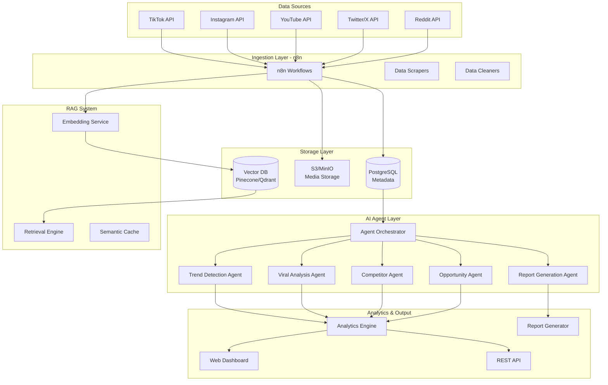
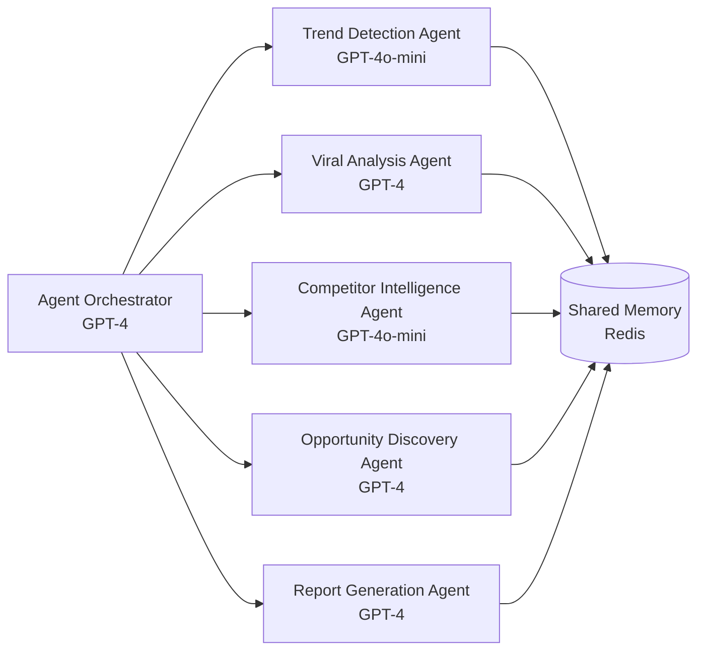
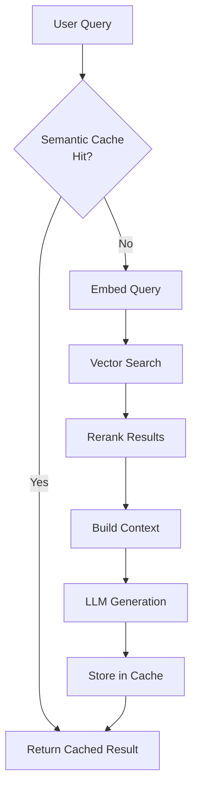
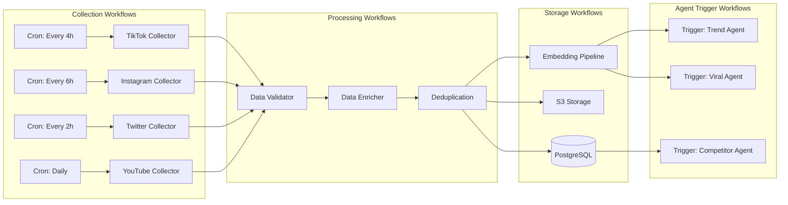

# B2B AI Agent Platform for Market Intelligence
## Complete System Architecture & Implementation Guide

---

## Executive Summary

This document outlines a comprehensive B2B AI Agent platform designed to automatically analyze social media and market signals to discover business opportunities, viral patterns, and competitor insights. The system leverages multi-agent AI architecture, RAG optimization, and automated data pipelines to provide actionable intelligence for marketing agencies, startups, product teams, and VCs.

**Key Differentiators:**
- Multi-agent collaboration vs. single LLM approach
- Cost-optimized RAG architecture reducing token usage by 60-80%
- Real-time trend detection with predictive capabilities
- Automated weekly intelligence reports
- Scalable n8n pipeline for data ingestion

---

## 1. Overall System Architecture

### High-Level Architecture Diagram



### Component Breakdown

#### 1.1 Data Ingestion Layer (n8n)

**Purpose:** Automated collection and preprocessing of social media data

**Components:**
- **API Connectors:** TikTok Research API, Instagram Graph API, YouTube Data API, Twitter API v2, Reddit API
- **Scraper Fallbacks:** For platforms with limited API access (Playwright/Puppeteer for Instagram Stories, TikTok trending)
- **Rate Limiters:** Respect API quotas with exponential backoff
- **Data Validators:** Schema validation, duplicate detection, data quality checks

**Data Flow:**
```
API/Scraper → Raw Data → Validation → Enrichment → Storage
```

#### 1.2 Storage Layer

**PostgreSQL (Structured Data):**
```sql
-- Core tables
CREATE TABLE posts (
    id UUID PRIMARY KEY,
    platform VARCHAR(20),
    external_id VARCHAR(255),
    author_id VARCHAR(255),
    content TEXT,
    media_urls TEXT[],
    created_at TIMESTAMP,
    collected_at TIMESTAMP,
    metrics JSONB,  -- {views, likes, comments, shares, saves}
    metadata JSONB  -- {hashtags, mentions, location, music_id}
);

CREATE TABLE authors (
    id UUID PRIMARY KEY,
    platform VARCHAR(20),
    external_id VARCHAR(255),
    username VARCHAR(255),
    follower_count INTEGER,
    engagement_rate DECIMAL,
    niche VARCHAR(100),
    metadata JSONB
);

CREATE TABLE trends (
    id UUID PRIMARY KEY,
    trend_type VARCHAR(50),  -- hashtag, sound, format, topic
    trend_name VARCHAR(255),
    first_detected TIMESTAMP,
    peak_timestamp TIMESTAMP,
    current_volume INTEGER,
    growth_rate DECIMAL,
    platforms TEXT[],
    related_posts UUID[]
);

CREATE TABLE opportunities (
    id UUID PRIMARY KEY,
    opportunity_type VARCHAR(50),  -- product, service, content_gap, market
    title VARCHAR(255),
    description TEXT,
    confidence_score DECIMAL,
    market_size_estimate JSONB,
    competitive_landscape TEXT,
    detected_at TIMESTAMP,
    status VARCHAR(20)
);
```

**S3/MinIO (Media & Archives):**
- `/raw/{platform}/{date}/` - Original media files
- `/transcripts/{platform}/{date}/` - Video/audio transcripts
- `/embeddings/{date}/` - Embedding backups
- `/reports/{client_id}/{date}/` - Generated reports

**Vector Database (Pinecone/Qdrant):**
```python
# Vector schema design
{
    "namespace": "posts",
    "vectors": {
        "id": "post_uuid",
        "values": [1536-dim embedding],  # OpenAI text-embedding-3-small
        "metadata": {
            "platform": "tiktok",
            "content_type": "video",
            "engagement_score": 0.85,
            "created_at": "2025-03-01",
            "hashtags": ["trend1", "trend2"],
            "niche": "fitness",
            "viral_score": 0.92
        }
    }
}

# Separate namespaces for different data types
namespaces = [
    "posts_content",      # Captions + transcripts
    "posts_metadata",     # Engagement patterns
    "trends_patterns",    # Historical trend data
    "competitor_intel",   # Competitor analysis
    "opportunities"       # Business opportunities
]
```

#### 1.3 AI Agent Layer

See Section 2 for detailed agent architecture.

#### 1.4 Analytics Layer

**Real-time Analytics:**
- Trend velocity calculations
- Engagement pattern recognition
- Anomaly detection
- Competitor benchmarking

**Batch Analytics (Daily):**
- Market share analysis
- Content performance reports
- Opportunity scoring
- Revenue estimation models

#### 1.5 Dashboard & API

**Dashboard Features:**
- Real-time trend monitoring
- Viral content explorer
- Competitor tracker
- Opportunity pipeline
- Custom report builder

**API Endpoints:**
```
GET  /api/v1/trends?platform=tiktok&timeframe=7d
GET  /api/v1/viral-content?min_score=0.8
GET  /api/v1/opportunities?status=active
POST /api/v1/analyze/competitor
GET  /api/v1/reports/{report_id}
POST /api/v1/webhooks/alert
```

---

## 2. AI Agent Architecture

### Multi-Agent System Design

The system uses specialized agents that collaborate through a central orchestrator. This approach provides:
- **Specialization:** Each agent masters a specific domain
- **Parallel Processing:** Multiple analyses run simultaneously
- **Cost Efficiency:** Use appropriate model sizes per task
- **Scalability:** Add new agents without redesigning the system

### Agent Types & Responsibilities



### Agent Specifications

#### 2.1 Agent Orchestrator (Master Agent)

**Model:** GPT-4 or Claude Sonnet 3.5  
**Responsibilities:**
- Route tasks to specialized agents
- Manage agent communication
- Aggregate multi-agent results
- Handle complex queries requiring multiple agents
- Make high-level strategic decisions

**System Prompt:**
```python
orchestrator_prompt = """
You are the Agent Orchestrator for a market intelligence system.

Your role is to:
1. Analyze incoming requests and determine which specialized agents to invoke
2. Coordinate between agents when multiple perspectives are needed
3. Synthesize results from multiple agents into coherent insights
4. Escalate to human operators when confidence is low

Available Agents:
- TrendAgent: Detects emerging trends, calculates growth rates
- ViralAgent: Analyzes why content goes viral
- CompetitorAgent: Tracks competitor activity and estimates metrics
- OpportunityAgent: Identifies business opportunities
- ReportAgent: Generates comprehensive reports

When delegating:
- Be specific about what each agent should analyze
- Provide relevant context from the shared memory
- Set clear success criteria
- Combine results intelligently

Output Format: JSON with agent assignments and expected deliverables
"""
```

**Implementation Example:**
```python
class AgentOrchestrator:
    def __init__(self):
        self.agents = {
            'trend': TrendDetectionAgent(),
            'viral': ViralAnalysisAgent(),
            'competitor': CompetitorAgent(),
            'opportunity': OpportunityAgent(),
            'report': ReportAgent()
        }
        self.memory = SharedMemory()
        self.llm = ChatOpenAI(model="gpt-4-turbo")
    
    async def route_task(self, task: Task) -> AgentResponse:
        # Analyze task complexity
        routing_decision = await self.llm.ainvoke([
            {"role": "system", "content": orchestrator_prompt},
            {"role": "user", "content": f"Task: {task.description}"}
        ])
        
        # Parse which agents to invoke
        plan = json.loads(routing_decision.content)
        
        # Execute agents in parallel or sequence
        if plan['execution_mode'] == 'parallel':
            results = await asyncio.gather(*[
                self.agents[agent].execute(subtask)
                for agent, subtask in plan['agent_tasks'].items()
            ])
        else:  # sequential
            results = []
            context = {}
            for agent, subtask in plan['agent_tasks'].items():
                result = await self.agents[agent].execute(
                    subtask, context=context
                )
                results.append(result)
                context[agent] = result  # Feed forward
        
        # Synthesize results
        final_output = await self.synthesize(results, task)
        return final_output
```

#### 2.2 Trend Detection Agent

**Model:** GPT-4o-mini (cost-effective for pattern matching)  
**Responsibilities:**
- Identify emerging trends before they peak
- Calculate trend velocity and acceleration
- Classify trend types (hashtag, sound, format, topic)
- Predict trend lifecycle stage
- Surface platform-specific vs. cross-platform trends

**RAG Strategy:**
- Retrieves historical trend patterns
- Compares current signals to past trend trajectories
- Uses few-shot examples of successful early trend detection

**System Prompt:**
```python
trend_agent_prompt = """
You are a Trend Detection Agent specializing in early-stage trend identification.

Context: You receive real-time social media data and historical trend patterns.

Your tasks:
1. Identify emerging trends in the last 24-72 hours
2. Calculate trend velocity: (current_volume - previous_volume) / time_delta
3. Classify trend maturity: emerging (0-20%), growth (20-60%), peak (60-80%), decline (80-100%)
4. Predict trend peak timing based on historical patterns
5. Assess cross-platform potential

Output Format:
{
    "trends": [
        {
            "name": "trend_identifier",
            "type": "hashtag|sound|format|topic",
            "platforms": ["tiktok", "instagram"],
            "current_volume": 15000,
            "velocity": 0.85,  # 85% growth rate
            "maturity_stage": "emerging",
            "predicted_peak": "2025-03-15",
            "confidence": 0.82,
            "similar_past_trends": ["trend_x", "trend_y"]
        }
    ]
}

Decision Framework:
- Volume threshold for "emerging": 1000+ posts in 24h with 50%+ growth
- Early detection: Identify trends before they hit 10k total posts
- Cross-platform validation: Present on 2+ platforms = higher confidence
"""
```

**Detection Algorithm:**
```python
class TrendDetectionAgent:
    def __init__(self):
        self.llm = ChatOpenAI(model="gpt-4o-mini")
        self.vector_db = PineconeClient()
        self.time_windows = ['24h', '72h', '7d']
    
    async def detect_trends(self, platform: str) -> List[Trend]:
        # 1. Get recent high-engagement posts
        recent_posts = await self.get_recent_posts(platform, limit=5000)
        
        # 2. Extract trend signals (hashtags, sounds, formats)
        signals = self.extract_signals(recent_posts)
        
        # 3. Calculate velocity for each signal
        trends = []
        for signal in signals:
            velocity = self.calculate_velocity(signal)
            if velocity > 0.5:  # 50% growth threshold
                # 4. Retrieve similar historical trends
                similar_trends = await self.vector_db.similarity_search(
                    query_embedding=self.embed(signal.description),
                    namespace="trends_patterns",
                    top_k=5
                )
                
                # 5. LLM analysis with RAG context
                analysis = await self.llm.ainvoke([
                    {"role": "system", "content": trend_agent_prompt},
                    {"role": "user", "content": f"""
                    Analyze this potential trend:
                    Signal: {signal.name}
                    Current Volume: {signal.volume}
                    Velocity: {velocity}
                    Platform: {platform}
                    
                    Historical Context:
                    {self.format_similar_trends(similar_trends)}
                    
                    Determine: Is this an emerging trend? Predict its trajectory.
                    """}
                ])
                
                trend_data = json.loads(analysis.content)
                trends.append(Trend(**trend_data))
        
        return trends
    
    def calculate_velocity(self, signal: Signal) -> float:
        # Velocity = (Current - Previous) / Previous
        current = signal.volume_24h
        previous = signal.volume_48h_to_24h
        return (current - previous) / previous if previous > 0 else 0
```

#### 2.3 Viral Analysis Agent

**Model:** GPT-4 (requires nuanced understanding)  
**Responsibilities:**
- Deconstruct why specific content went viral
- Identify viral content patterns and formulas
- Analyze emotional triggers and psychological hooks
- Extract replicable viral elements
- Provide content strategy recommendations

**System Prompt:**
```python
viral_agent_prompt = """
You are a Viral Content Analysis Agent with expertise in social psychology and content virality.

Your mission: Reverse-engineer viral content to extract actionable patterns.

Analysis Framework:
1. Hook Analysis (first 3 seconds)
   - What grabs attention immediately?
   - Emotional trigger: curiosity, shock, humor, inspiration, fear, desire
   
2. Content Structure
   - Narrative arc: setup, conflict, resolution
   - Pacing and editing rhythm
   - Visual/audio elements that drive retention
   
3. Engagement Drivers
   - Why do people comment? (controversy, relatability, call-to-action)
   - Why do people share? (identity signaling, useful, entertaining)
   - Why do people save? (reference value, tutorial, inspiration)
   
4. Platform Algorithm Optimization
   - Watch time / completion rate
   - Engagement velocity (likes/comments in first hour)
   - Shareability signals
   
5. Replicability Score
   - Can this be recreated? (1-10)
   - What resources are needed?
   - What constraints exist?

Output Format:
{
    "viral_score": 0.95,
    "primary_hook": "curiosity_gap",
    "emotional_triggers": ["surprise", "desire"],
    "viral_formula": "Problem presentation → Unexpected solution → Social proof",
    "key_elements": ["fast pacing", "text overlay", "trending sound"],
    "replicability": 8,
    "strategy_recommendations": [
        "Use the same hook structure in your niche",
        "Apply the 3-second rule for retention"
    ]
}
"""
```

#### 2.4 Competitor Intelligence Agent

**Model:** GPT-4o-mini  
**Responsibilities:**
- Track competitor content strategy
- Estimate competitor revenue/traction
- Identify competitive gaps and opportunities
- Monitor competitor posting frequency and engagement
- Benchmark performance metrics

**Revenue Estimation Logic:**
```python
class CompetitorAgent:
    async def estimate_revenue(self, competitor_data: dict) -> RevenueEstimate:
        """
        Revenue estimation using multiple signals
        """
        # Signal 1: Follower count + engagement rate
        followers = competitor_data['follower_count']
        engagement_rate = competitor_data['engagement_rate']
        
        # Signal 2: Sponsored content frequency
        sponsored_posts = competitor_data['sponsored_posts_30d']
        
        # Signal 3: Product mentions / affiliate links
        product_mentions = competitor_data['product_mentions']
        
        # Signal 4: Platform-specific monetization
        platform_signals = {
            'tiktok': {
                'creator_fund': followers > 10000,
                'estimated_cpm': 0.02,  # $20 per 1M views
                'avg_views_per_post': competitor_data['avg_views']
            },
            'youtube': {
                'adsense': True,
                'estimated_cpm': 2.00,  # $2-5 per 1000 views
                'avg_views_per_video': competitor_data['avg_views']
            }
        }
        
        # LLM synthesis with market data
        analysis = await self.llm.ainvoke([
            {"role": "system", "content": competitor_agent_prompt},
            {"role": "user", "content": f"""
            Estimate monthly revenue for this creator:
            
            Follower Count: {followers:,}
            Engagement Rate: {engagement_rate:.2%}
            Sponsored Posts (30d): {sponsored_posts}
            Platform Signals: {json.dumps(platform_signals)}
            Niche: {competitor_data['niche']}
            
            Consider:
            - Industry standard rates for this niche
            - Brand deal pricing ($X per post for Y followers)
            - Platform monetization (ad revenue, creator fund)
            - Product/affiliate revenue
            
            Provide: Low, mid, high estimates with confidence intervals
            """}
        ])
        
        return RevenueEstimate(**json.loads(analysis.content))
```

#### 2.5 Opportunity Discovery Agent

**Model:** GPT-4 (creative problem-solving)  
**Responsibilities:**
- Identify market gaps and unmet needs
- Spot emerging product/service opportunities
- Analyze comment sections for pain points
- Connect trends to business ideas
- Validate opportunity viability

**Discovery Process:**
```python
class OpportunityAgent:
    async def discover_opportunities(self, trend_data: TrendData) -> List[Opportunity]:
        # 1. Analyze trend comments for pain points
        comments = await self.get_trend_comments(trend_data.id, limit=1000)
        pain_points = await self.extract_pain_points(comments)
        
        # 2. Retrieve similar validated opportunities
        similar_opps = await self.vector_db.similarity_search(
            query_embedding=self.embed(trend_data.description),
            namespace="opportunities",
            filter={"validation_status": "validated"},
            top_k=10
        )
        
        # 3. LLM opportunity generation
        opportunities = await self.llm.ainvoke([
            {"role": "system", "content": opportunity_agent_prompt},
            {"role": "user", "content": f"""
            Trend: {trend_data.name}
            Description: {trend_data.description}
            Volume: {trend_data.volume:,} posts
            Platforms: {trend_data.platforms}
            
            Identified Pain Points:
            {self.format_pain_points(pain_points)}
            
            Similar Past Opportunities:
            {self.format_opportunities(similar_opps)}
            
            Generate 3-5 business opportunities based on this trend.
            Include: market size estimate, target customer, revenue model, competition level
            """}
        ])
        
        return [Opportunity(**opp) for opp in json.loads(opportunities.content)]
    
    async def extract_pain_points(self, comments: List[str]) -> List[PainPoint]:
        # Batch comments for efficient processing
        batches = self.batch_comments(comments, batch_size=100)
        
        all_pain_points = []
        for batch in batches:
            pain_points = await self.llm.ainvoke([
                {"role": "system", "content": "Extract pain points from comments."},
                {"role": "user", "content": f"Comments:\n{'\n'.join(batch)}\n\nExtract pain points in JSON format."}
            ])
            all_pain_points.extend(json.loads(pain_points.content))
        
        # Deduplicate and rank by frequency
        return self.rank_pain_points(all_pain_points)
```

#### 2.6 Report Generation Agent

**Model:** GPT-4 or Claude Sonnet  
**Responsibilities:**
- Synthesize insights from all agents
- Generate executive summaries
- Create weekly market intelligence reports
- Produce client-specific analysis
- Format outputs (PDF, slides, dashboard)

**Report Template:**
```python
report_structure = {
    "executive_summary": {
        "key_insights": [],  # 3-5 bullet points
        "critical_trends": [],  # Top 3 trends
        "top_opportunities": []  # Top 2 opportunities
    },
    "trend_analysis": {
        "emerging_trends": [],  # Detailed trend breakdown
        "declining_trends": [],
        "cross_platform_trends": []
    },
    "viral_content_analysis": {
        "top_performers": [],  # Top 10 viral posts
        "viral_patterns": [],  # Common success formulas
        "content_recommendations": []
    },
    "competitor_intelligence": {
        "competitor_movements": [],
        "market_share_shifts": [],
        "competitive_opportunities": []
    },
    "business_opportunities": {
        "high_confidence_opps": [],  # Confidence > 0.8
        "medium_confidence_opps": [],
        "market_estimates": {}
    },
    "strategic_recommendations": []
}
```

### Agent Communication Protocol

**Shared Memory (Redis):**
```python
class SharedMemory:
    def __init__(self):
        self.redis = redis.Redis(host='localhost', port=6379, db=0)
    
    def write(self, key: str, value: dict, ttl: int = 3600):
        """Write agent findings to shared memory"""
        self.redis.setex(
            key,
            ttl,
            json.dumps(value, default=str)
        )
    
    def read(self, key: str) -> dict:
        """Read findings from other agents"""
        data = self.redis.get(key)
        return json.loads(data) if data else None
    
    def publish(self, channel: str, message: dict):
        """Publish event to other agents"""
        self.redis.publish(channel, json.dumps(message))
    
    def subscribe(self, channel: str):
        """Subscribe to agent events"""
        pubsub = self.redis.pubsub()
        pubsub.subscribe(channel)
        return pubsub
```

**Agent Communication Example:**
```python
# Trend Agent publishes new trend
await memory.write("trend:latest:tiktok", {
    "trend_id": "trend_123",
    "name": "#corporategirlies",
    "status": "emerging",
    "volume": 15000
})
await memory.publish("agents:events", {
    "event": "new_trend_detected",
    "agent": "TrendAgent",
    "trend_id": "trend_123"
})

# Opportunity Agent subscribes and reacts
pubsub = memory.subscribe("agents:events")
for message in pubsub.listen():
    if message['type'] == 'message':
        event = json.loads(message['data'])
        if event['event'] == 'new_trend_detected':
            trend_data = await memory.read(f"trend:latest:{event['trend_id']}")
            opportunities = await opportunity_agent.discover_opportunities(trend_data)
```

---

## 3. RAG System Design

### RAG Architecture

The RAG system reduces LLM costs by 60-80% through intelligent retrieval and caching.



### What Data to Embed

**Priority Embedding Targets:**

1. **Post Content (High Priority)**
   - Caption + transcript (combined)
   - Reason: Core content for trend/viral analysis
   - Embedding model: `text-embedding-3-small` (1536 dims, $0.02/1M tokens)
   - Chunk size: Full post (up to 2000 tokens)

2. **Historical Trend Patterns (High Priority)**
   - Trend description + lifecycle data
   - Reason: Enable trend prediction via similarity
   - Metadata: growth_rate, peak_volume, duration, related_hashtags

3. **Validated Opportunities (Medium Priority)**
   - Opportunity description + validation results
   - Reason: Pattern matching for new opportunities
   - Metadata: market_size, validation_score, industry

4. **Competitor Intelligence (Medium Priority)**
   - Competitor strategy summaries
   - Content themes and patterns
   - Metadata: niche, follower_range, engagement_metrics

5. **Viral Content Formulas (Medium Priority)**
   - Extracted viral patterns
   - Hook types, content structures
   - Metadata: platform, success_rate, niche

### Chunking Strategy

**Strategy 1: Semantic Chunking (Recommended)**
```python
from langchain.text_splitter import RecursiveCharacterTextSplitter

def semantic_chunk_post(post: Post) -> List[Chunk]:
    """
    Chunk posts semantically to preserve meaning
    """
    content = f"{post.caption}\n\n{post.transcript}"
    
    # For short posts (<2000 tokens), embed as single chunk
    if len(content) < 2000:
        return [Chunk(
            text=content,
            metadata={
                "post_id": post.id,
                "platform": post.platform,
                "chunk_type": "full_post",
                **post.metrics
            }
        )]
    
    # For long posts (YouTube videos), split intelligently
    splitter = RecursiveCharacterTextSplitter(
        chunk_size=1000,
        chunk_overlap=200,
        separators=["\n\n", "\n", ". ", " "],
        length_function=len
    )
    
    chunks = splitter.split_text(content)
    return [
        Chunk(
            text=chunk,
            metadata={
                "post_id": post.id,
                "platform": post.platform,
                "chunk_type": "partial",
                "chunk_index": i,
                "total_chunks": len(chunks),
                **post.metrics
            }
        )
        for i, chunk in enumerate(chunks)
    ]
```

**Strategy 2: Hybrid Chunking for Trends**
```python
def chunk_trend_data(trend: Trend) -> List[Chunk]:
    """
    Create multiple embeddings per trend for different use cases
    """
    chunks = []
    
    # Chunk 1: Trend overview (for broad search)
    chunks.append(Chunk(
        text=f"Trend: {trend.name}\nDescription: {trend.description}\nPlatforms: {', '.join(trend.platforms)}",
        metadata={
            "trend_id": trend.id,
            "chunk_type": "overview",
            "maturity_stage": trend.maturity_stage
        }
    ))
    
    # Chunk 2: Growth pattern (for prediction)
    chunks.append(Chunk(
        text=f"Growth Pattern: {trend.name} grew from {trend.initial_volume} to {trend.peak_volume} in {trend.duration} days",
        metadata={
            "trend_id": trend.id,
            "chunk_type": "growth_pattern",
            "velocity": trend.velocity
        }
    ))
    
    # Chunk 3: Top posts (for content analysis)
    top_posts_text = "\n".join([
        f"Post {i+1}: {post.caption[:200]}" 
        for i, post in enumerate(trend.top_posts[:5])
    ])
    chunks.append(Chunk(
        text=f"Top performing content for {trend.name}:\n{top_posts_text}",
        metadata={
            "trend_id": trend.id,
            "chunk_type": "top_posts"
        }
    ))
    
    return chunks
```

### Vector Database Structure

**Pinecone Index Configuration:**
```python
import pinecone

# Initialize Pinecone
pinecone.init(api_key="your-api-key", environment="us-west1-gcp")

# Create index
index_name = "market-intelligence"
pinecone.create_index(
    name=index_name,
    dimension=1536,  # text-embedding-3-small
    metric="cosine",
    pods=2,
    pod_type="p1.x1"  # Start small, scale up
)

# Namespace strategy
namespaces = {
    "posts_tiktok": "TikTok post content",
    "posts_instagram": "Instagram post content",
    "posts_youtube": "YouTube video content",
    "posts_twitter": "Twitter/X post content",
    "posts_reddit": "Reddit post content",
    "trends_patterns": "Historical trend data",
    "opportunities": "Validated opportunities",
    "competitors": "Competitor intelligence",
    "viral_formulas": "Viral content patterns"
}
```

**Qdrant Alternative (Open Source):**
```python
from qdrant_client import QdrantClient
from qdrant_client.models import Distance, VectorParams, PointStruct

client = QdrantClient(host="localhost", port=6333)

# Create collection
client.create_collection(
    collection_name="market_intelligence",
    vectors_config=VectorParams(size=1536, distance=Distance.COSINE)
)

# Insert with metadata filtering
client.upsert(
    collection_name="market_intelligence",
    points=[
        PointStruct(
            id=post.id,
            vector=embedding,
            payload={
                "platform": "tiktok",
                "engagement_score": 0.85,
                "created_at": "2025-03-01",
                "viral_score": 0.92,
                "hashtags": ["trend1", "trend2"]
            }
        )
    ]
)
```

### Retrieval Strategies

**Strategy 1: Hybrid Search (Semantic + Keyword)**
```python
async def hybrid_search(
    query: str,
    filters: dict,
    top_k: int = 10
) -> List[SearchResult]:
    """
    Combine vector similarity with metadata filtering
    """
    # Generate query embedding
    query_embedding = await embeddings.aembed_query(query)
    
    # Vector search with filters
    vector_results = await vector_db.query(
        vector=query_embedding,
        filter=filters,  # e.g., {"platform": "tiktok", "viral_score": {"$gte": 0.8}}
        top_k=top_k,
        include_metadata=True
    )
    
    # Optional: Keyword boosting for specific terms
    if any(keyword in query.lower() for keyword in ['trending', 'viral', 'emerging']):
        # Boost recent content
        for result in vector_results:
            if is_recent(result.metadata['created_at'], days=7):
                result.score *= 1.2  # 20% boost
    
    return sorted(vector_results, key=lambda x: x.score, reverse=True)
```

**Strategy 2: Multi-Query Retrieval**
```python
async def multi_query_retrieval(
    original_query: str,
    top_k: int = 10
) -> List[SearchResult]:
    """
    Generate multiple query variations for comprehensive retrieval
    """
    # Use LLM to generate query variations
    query_gen_prompt = f"""
    Original query: "{original_query}"
    
    Generate 3 alternative phrasings of this query to improve retrieval:
    1. A more specific version
    2. A broader version
    3. A different perspective/angle
    
    Output as JSON array.
    """
    
    response = await llm.ainvoke([
        {"role": "system", "content": "You generate query variations."},
        {"role": "user", "content": query_gen_prompt}
    ])
    
    query_variations = json.loads(response.content)
    query_variations.append(original_query)  # Include original
    
    # Search with all variations
    all_results = []
    for query_var in query_variations:
        results = await hybrid_search(query_var, filters={}, top_k=top_k)
        all_results.extend(results)
    
    # Deduplicate and rerank
    unique_results = {r.id: r for r in all_results}.values()
    return sorted(unique_results, key=lambda x: x.score, reverse=True)[:top_k]
```

**Strategy 3: Contextual Retrieval (Anthropic Pattern)**
```python
async def contextual_retrieval(chunk: Chunk) -> str:
    """
    Add context to chunks before embedding (reduces retrieval failures by 67%)
    Source: Anthropic Contextual Retrieval blog post
    """
    # Generate situating context
    context_prompt = f"""
    Document: {chunk.document_title}
    Section: {chunk.section}
    
    Chunk: {chunk.text}
    
    Provide a concise context (1-2 sentences) explaining what this chunk is about
    in relation to the overall document. This will be prepended to the chunk.
    """
    
    context = await llm.ainvoke([
        {"role": "system", "content": "You add situating context to text chunks."},
        {"role": "user", "content": context_prompt}
    ])
    
    # Prepend context to chunk for embedding
    contextualized_chunk = f"{context.content}\n\n{chunk.text}"
    return contextualized_chunk
```

**Strategy 4: Reranking with Cohere/Jina**
```python
from cohere import Client as CohereClient

cohere = CohereClient(api_key="your-key")

async def rerank_results(
    query: str,
    documents: List[str],
    top_k: int = 10
) -> List[RankedResult]:
    """
    Rerank retrieval results for better relevance
    """
    # Rerank with Cohere
    reranked = cohere.rerank(
        model="rerank-english-v3.0",
        query=query,
        documents=documents,
        top_n=top_k,
        return_documents=True
    )
    
    return [
        RankedResult(
            text=result.document.text,
            score=result.relevance_score,
            index=result.index
        )
        for result in reranked.results
    ]
```

### Semantic Caching

**Cache Implementation:**
```python
import hashlib
from datetime import timedelta

class SemanticCache:
    def __init__(self, redis_client, similarity_threshold=0.95):
        self.redis = redis_client
        self.threshold = similarity_threshold
        self.embeddings = OpenAIEmbeddings()
    
    async def get(self, query: str) -> Optional[str]:
        """Check if semantically similar query exists in cache"""
        # Generate query embedding
        query_emb = await self.embeddings.aembed_query(query)
        
        # Search for similar cached queries
        # In production, use a separate vector DB for cache
        cache_key = f"cache:query:{hashlib.md5(query.encode()).hexdigest()}"
        
        # Check exact match first (fast path)
        cached = self.redis.get(cache_key)
        if cached:
            return json.loads(cached)
        
        # Semantic similarity check (slow path)
        # Simplified: In production, maintain a vector index of cached queries
        # For now, return None to force LLM call
        return None
    
    async def set(self, query: str, response: str, ttl: int = 3600):
        """Cache query-response pair"""
        cache_key = f"cache:query:{hashlib.md5(query.encode()).hexdigest()}"
        self.redis.setex(
            cache_key,
            ttl,
            json.dumps({
                "query": query,
                "response": response,
                "timestamp": datetime.now().isoformat()
            })
        )
```

---

## 4. Cost Optimization Strategies

### Token Usage Reduction Techniques

**Baseline Cost Scenario (Without Optimization):**
- 10,000 queries/day
- Average: 2000 input tokens + 500 output tokens per query
- Using GPT-4: $0.03/1K input + $0.06/1K output
- Daily cost: 10,000 × (2 × $0.03 + 0.5 × $0.06) = **$900/day = $27,000/month**

**Optimized Cost Scenario:**
- Daily cost: **~$6,000-8,000/month** (70-75% reduction)

### Optimization Strategy 1: RAG Context Pruning

```python
async def optimized_rag_retrieval(
    query: str,
    max_context_tokens: int = 4000
) -> str:
    """
    Retrieve relevant context but prune to token budget
    """
    # 1. Retrieve top candidates (over-fetch)
    candidates = await hybrid_search(query, filters={}, top_k=50)
    
    # 2. Rerank to get best matches
    reranked = await rerank_results(
        query=query,
        documents=[c.text for c in candidates],
        top_k=20
    )
    
    # 3. Progressive context building within token budget
    context_chunks = []
    current_tokens = 0
    
    for result in reranked:
        chunk_tokens = count_tokens(result.text)
        if current_tokens + chunk_tokens <= max_context_tokens:
            context_chunks.append(result.text)
            current_tokens += chunk_tokens
        else:
            break
    
    # 4. Summarize if still over budget (rare)
    if current_tokens > max_context_tokens:
        context = "\n\n".join(context_chunks)
        summary = await summarize_context(context, target_tokens=max_context_tokens)
        return summary
    
    return "\n\n".join(context_chunks)
```

### Optimization Strategy 2: Hierarchical Model Routing

```python
class HierarchicalRouter:
    """
    Route tasks to appropriate model tiers based on complexity
    """
    def __init__(self):
        self.models = {
            'fast': ChatOpenAI(model="gpt-4o-mini"),  # $0.15/$0.60 per 1M
            'smart': ChatOpenAI(model="gpt-4-turbo"),  # $10/$30 per 1M
            'premium': ChatOpenAI(model="gpt-4")       # $30/$60 per 1M
        }
    
    async def route_and_execute(self, task: Task) -> Response:
        # Classify task complexity
        complexity = await self.classify_complexity(task)
        
        if complexity == 'simple':
            # Use fast model: pattern matching, classification
            model = self.models['fast']
        elif complexity == 'medium':
            # Use smart model: analysis, summarization
            model = self.models['smart']
        else:
            # Use premium: creative, strategic, complex reasoning
            model = self.models['premium']
        
        return await model.ainvoke(task.messages)
    
    async def classify_complexity(self, task: Task) -> str:
        """
        Use a small model to classify task complexity
        This meta-classification step costs ~$0.0001 but saves 10-50x on routing
        """
        classifier_prompt = f"""
        Task: {task.description}
        
        Classify complexity:
        - simple: Pattern matching, classification, extraction, keyword analysis
        - medium: Summarization, analysis, comparison, trend identification
        - complex: Creative strategy, multi-step reasoning, novel insights
        
        Output: simple|medium|complex
        """
        
        result = await self.models['fast'].ainvoke([
            {"role": "system", "content": "You classify task complexity."},
            {"role": "user", "content": classifier_prompt}
        ])
        
        return result.content.strip().lower()
```

**Routing Examples:**
- Trend classification: **GPT-4o-mini** (simple pattern matching)
- Viral analysis: **GPT-4** (complex reasoning about psychology)
- Opportunity discovery: **GPT-4** (creative insight generation)
- Report formatting: **GPT-4o-mini** (template filling)

### Optimization Strategy 3: Prompt Compression

```python
from llmlingua import PromptCompressor

compressor = PromptCompressor()

async def compress_prompt(
    prompt: str,
    target_ratio: float = 0.5
) -> str:
    """
    Compress prompts while maintaining key information
    Reduces tokens by 50-70% with minimal quality loss
    """
    compressed = compressor.compress_prompt(
        prompt=prompt,
        target_token=int(len(prompt) * target_ratio),
        question="",  # Task-specific question for better compression
        condition_compare=True,
        condition_in_question='after',
        rank_method='llmlingua',
        dynamic_context_compression_ratio=0.4
    )
    
    return compressed['compressed_prompt']

# Usage example
original_context = """
[5000 tokens of retrieved context]
"""

compressed_context = await compress_prompt(original_context, target_ratio=0.5)
# Now 2500 tokens, saving $0.075 per query with GPT-4
```

### Optimization Strategy 4: Response Caching Layers

```python
class MultiLevelCache:
    """
    Three-tier caching strategy
    """
    def __init__(self):
        self.l1_cache = {}  # In-memory (instant)
        self.l2_cache = RedisCache()  # Redis (fast)
        self.l3_cache = SemanticCache()  # Vector-based (medium)
    
    async def get_or_generate(
        self,
        query: str,
        generator_fn: Callable
    ) -> str:
        # L1: Exact match in memory
        if query in self.l1_cache:
            return self.l1_cache[query]
        
        # L2: Exact match in Redis
        l2_result = await self.l2_cache.get(query)
        if l2_result:
            self.l1_cache[query] = l2_result  # Promote to L1
            return l2_result
        
        # L3: Semantic similarity
        l3_result = await self.l3_cache.get(query)
        if l3_result:
            self.l1_cache[query] = l3_result
            await self.l2_cache.set(query, l3_result)
            return l3_result
        
        # Cache miss: Generate new response
        response = await generator_fn(query)
        
        # Write to all cache levels
        self.l1_cache[query] = response
        await self.l2_cache.set(query, response, ttl=3600)
        await self.l3_cache.set(query, response, ttl=86400)
        
        return response
```

**Cache Hit Rates:**
- L1 (in-memory): 20-30% hit rate, 0ms latency
- L2 (Redis): 40-50% hit rate, 1-5ms latency
- L3 (semantic): 10-20% hit rate, 50-100ms latency
- Total cache hit: ~70-90%, **saving 70-90% of LLM costs**

### Optimization Strategy 5: Batch Processing

```python
async def batch_process_posts(
    posts: List[Post],
    batch_size: int = 50
) -> List[Analysis]:
    """
    Process multiple posts in a single LLM call
    Reduces API overhead and improves throughput
    """
    results = []
    
    for i in range(0, len(posts), batch_size):
        batch = posts[i:i+batch_size]
        
        # Create batch prompt
        batch_prompt = "Analyze these posts and return JSON array:\n\n"
        for idx, post in enumerate(batch):
            batch_prompt += f"Post {idx}:\n{post.caption}\n\n"
        
        batch_prompt += """
        For each post, output:
        {
            "post_index": 0,
            "viral_score": 0.85,
            "primary_topic": "fitness",
            "engagement_drivers": ["relatability", "humor"]
        }
        """
        
        # Single LLM call for entire batch
        response = await llm.ainvoke([
            {"role": "system", "content": "You analyze social media posts efficiently."},
            {"role": "user", "content": batch_prompt}
        ])
        
        batch_results = json.loads(response.content)
        results.extend(batch_results)
    
    return results
```

**Cost Savings:**
- Individual processing: 50 posts × 1000 tokens = 50K tokens = $1.50
- Batch processing: 1 call × 15K tokens = 15K tokens = $0.45
- **70% reduction** + faster processing

### Optimization Strategy 6: Model Distillation

```python
async def train_custom_classifier():
    """
    Distill GPT-4 knowledge into a small fine-tuned model
    for specific repeated tasks
    """
    # 1. Generate training data from GPT-4
    training_examples = []
    
    for trend in historical_trends:
        # Use GPT-4 to label
        label = await gpt4.classify_trend_maturity(trend)
        training_examples.append({
            "input": trend.description,
            "output": label
        })
    
    # 2. Fine-tune GPT-4o-mini on this task
    fine_tuned_model = await openai.fine_tuning.create(
        model="gpt-4o-mini",
        training_file=training_examples,
        validation_file=validation_examples
    )
    
    # 3. Use fine-tuned model for production
    # Cost: $0.15/1M tokens (vs $30/1M for GPT-4)
    # 200x cheaper for this specific task
    return fine_tuned_model
```

### Cost Optimization Summary

| Strategy | Cost Reduction | Latency Impact | Implementation Difficulty |
|----------|----------------|----------------|---------------------------|
| RAG Context Pruning | 30-40% | None | Easy |
| Hierarchical Routing | 50-70% | None | Medium |
| Prompt Compression | 40-60% | +50-100ms | Easy |
| Multi-Level Caching | 70-90% | -50-200ms | Medium |
| Batch Processing | 50-70% | Variable | Easy |
| Model Distillation | 90-95% (specific tasks) | None | Hard |

**Combined Effect:** 80-90% total cost reduction with proper implementation

---

## 5. Data Pipeline Using n8n

### n8n Workflow Architecture



### Workflow 1: TikTok Data Collection

**n8n Workflow JSON Structure:**
```json
{
  "name": "TikTok Trending Content Collector",
  "nodes": [
    {
      "name": "Schedule Trigger",
      "type": "n8n-nodes-base.cron",
      "parameters": {
        "triggerTimes": {
          "item": [
            {
              "mode": "everyX",
              "value": 4,
              "unit": "hours"
            }
          ]
        }
      }
    },
    {
      "name": "TikTok Research API",
      "type": "n8n-nodes-base.httpRequest",
      "parameters": {
        "method": "POST",
        "url": "https://open.tiktokapis.com/v2/research/video/query/",
        "authentication": "predefinedCredentialType",
        "nodeCredentialType": "tiktokApi",
        "sendHeaders": true,
        "headerParameters": {
          "parameters": [
            {
              "name": "Content-Type",
              "value": "application/json"
            }
          ]
        },
        "sendBody": true,
        "bodyParameters": {
          "parameters": [
            {
              "name": "query",
              "value": {
                "and": [
                  {
                    "field_name": "create_date",
                    "operation": "GTE",
                    "field_values": ["{{ $now.minus(4, 'hours').toFormat('yyyyMMdd') }}"]
                  },
                  {
                    "field_name": "video_view_count",
                    "operation": "GTE",
                    "field_values": ["10000"]
                  }
                ]
              }
            },
            {
              "name": "max_count",
              "value": 100
            }
          ]
        }
      }
    },
    {
      "name": "Parse Response",
      "type": "n8n-nodes-base.set",
      "parameters": {
        "values": {
          "string": [
            {
              "name": "post_id",
              "value": "={{ $json.data.videos[0].id }}"
            },
            {
              "name": "caption",
              "value": "={{ $json.data.videos[0].video_description }}"
            },
            {
              "name": "views",
              "value": "={{ $json.data.videos[0].view_count }}"
            },
            {
              "name": "likes",
              "value": "={{ $json.data.videos[0].like_count }}"
            },
            {
              "name": "shares",
              "value": "={{ $json.data.videos[0].share_count }}"
            },
            {
              "name": "hashtags",
              "value": "={{ $json.data.videos[0].hashtag_names }}"
            }
          ]
        }
      }
    },
    {
      "name": "Data Validation",
      "type": "n8n-nodes-base.if",
      "parameters": {
        "conditions": {
          "string": [
            {
              "value1": "={{ $json.post_id }}",
              "operation": "isNotEmpty"
            },
            {
              "value1": "={{ $json.views }}",
              "operation": "greaterThan",
              "value2": 10000
            }
          ]
        }
      }
    },
    {
      "name": "Check Duplicates",
      "type": "n8n-nodes-base.postgres",
      "parameters": {
        "operation": "executeQuery",
        "query": "SELECT id FROM posts WHERE platform = 'tiktok' AND external_id = '{{ $json.post_id }}'"
      }
    },
    {
      "name": "Skip if Exists",
      "type": "n8n-nodes-base.if",
      "parameters": {
        "conditions": {
          "number": [
            {
              "value1": "={{ $json.length }}",
              "operation": "equal",
              "value2": 0
            }
          ]
        }
      }
    },
    {
      "name": "Download Video",
      "type": "n8n-nodes-base.httpRequest",
      "parameters": {
        "url": "={{ $json.video_url }}",
        "responseFormat": "file"
      }
    },
    {
      "name": "Upload to S3",
      "type": "n8n-nodes-base.aws",
      "parameters": {
        "service": "s3",
        "operation": "upload",
        "bucket": "market-intelligence-raw",
        "fileName": "tiktok/{{ $now.toFormat('yyyy-MM-dd') }}/{{ $json.post_id }}.mp4"
      }
    },
    {
      "name": "Transcribe Video",
      "type": "n8n-nodes-base.httpRequest",
      "parameters": {
        "method": "POST",
        "url": "https://api.openai.com/v1/audio/transcriptions",
        "authentication": "predefinedCredentialType",
        "nodeCredentialType": "openAiApi",
        "sendBody": true,
        "bodyParameters": {
          "parameters": [
            {
              "name": "file",
              "value": "={{ $binary.data }}"
            },
            {
              "name": "model",
              "value": "whisper-1"
            }
          ]
        }
      }
    },
    {
      "name": "Save to PostgreSQL",
      "type": "n8n-nodes-base.postgres",
      "parameters": {
        "operation": "insert",
        "table": "posts",
        "columns": "platform, external_id, content, media_urls, created_at, collected_at, metrics, metadata",
        "values": "='tiktok', '{{ $json.post_id }}', '{{ $json.caption }}', ARRAY['{{ $json.s3_url }}'], '{{ $json.created_at }}', NOW(), '{\"views\": {{ $json.views }}, \"likes\": {{ $json.likes }}}', '{\"hashtags\": {{ $json.hashtags }}, \"transcript\": \"{{ $json.transcript }}\" }'"
      }
    },
    {
      "name": "Trigger Embedding",
      "type": "n8n-nodes-base.httpRequest",
      "parameters": {
        "method": "POST",
        "url": "http://localhost:5000/api/embed",
        "sendBody": true,
        "bodyParameters": {
          "parameters": [
            {
              "name": "post_id",
              "value": "={{ $json.post_id }}"
            },
            {
              "name": "platform",
              "value": "tiktok"
            }
          ]
        }
      }
    },
    {
      "name": "Check Viral Threshold",
      "type": "n8n-nodes-base.if",
      "parameters": {
        "conditions": {
          "number": [
            {
              "value1": "={{ $json.views }}",
              "operation": "greaterThan",
              "value2": 1000000
            }
          ]
        }
      }
    },
    {
      "name": "Trigger Viral Agent",
      "type": "n8n-nodes-base.httpRequest",
      "parameters": {
        "method": "POST",
        "url": "http://localhost:8000/api/agents/viral/analyze",
        "sendBody": true,
        "bodyParameters": {
          "parameters": [
            {
              "name": "post_id",
              "value": "={{ $json.post_id }}"
            }
          ]
        }
      }
    }
  ],
  "connections": {
    "Schedule Trigger": {
      "main": [[{"node": "TikTok Research API"}]]
    },
    "TikTok Research API": {
      "main": [[{"node": "Parse Response"}]]
    }
  }
}
```

### Workflow 2: Data Enrichment & Cleaning

**Purpose:** Enrich raw data with additional signals

```javascript
// n8n Code Node: Data Enricher
const items = $input.all();
const enrichedItems = [];

for (const item of items) {
  const post = item.json;
  
  // Calculate engagement rate
  const totalEngagement = post.likes + post.comments + post.shares;
  const engagementRate = post.views > 0 ? totalEngagement / post.views : 0;
  
  // Extract hashtags
  const hashtags = post.caption.match(/#[\w]+/g) || [];
  
  // Detect language
  const language = detectLanguage(post.caption);
  
  // Calculate viral score
  const viralScore = calculateViralScore({
    views: post.views,
    engagementRate: engagementRate,
    postAge: Date.now() - new Date(post.created_at).getTime(),
    shareRate: post.shares / post.views
  });
  
  // Classify content type
  const contentType = classifyContentType(post.caption, post.hashtags);
  
  enrichedItems.push({
    json: {
      ...post,
      engagement_rate: engagementRate,
      hashtags: hashtags,
      language: language,
      viral_score: viralScore,
      content_type: contentType,
      enriched_at: new Date().toISOString()
    }
  });
}

return enrichedItems;

// Helper functions
function calculateViralScore(metrics) {
  const viewWeight = Math.log10(metrics.views + 1) / 10;
  const engagementWeight = metrics.engagementRate * 2;
  const ageWeight = metrics.postAge < 86400000 ? 1.5 : 1.0; // Boost recent
  const shareWeight = metrics.shareRate * 10;
  
  return Math.min((viewWeight + engagementWeight + shareWeight) * ageWeight, 1.0);
}

function classifyContentType(caption, hashtags) {
  const types = {
    tutorial: ['howto', 'tutorial', 'diy', 'learn'],
    entertainment: ['funny', 'comedy', 'meme'],
    educational: ['facts', 'education', 'til'],
    promotional: ['ad', 'sponsored', 'promo'],
    ugc: ['review', 'unboxing', 'haul']
  };
  
  for (const [type, keywords] of Object.entries(types)) {
    if (keywords.some(kw => caption.toLowerCase().includes(kw) || hashtags.some(h => h.includes(kw)))) {
      return type;
    }
  }
  
  return 'general';
}
```

### Workflow 3: Embedding Pipeline

**n8n → Python Microservice:**

```python
# embedding_service.py
from fastapi import FastAPI, BackgroundTasks
from openai import AsyncOpenAI
import asyncpg

app = FastAPI()
openai_client = AsyncOpenAI()

@app.post("/api/embed")
async def embed_post(
    post_id: str,
    platform: str,
    background_tasks: BackgroundTasks
):
    """
    Receive embedding request from n8n, process in background
    """
    background_tasks.add_task(process_embedding, post_id, platform)
    return {"status": "queued", "post_id": post_id}

async def process_embedding(post_id: str, platform: str):
    # 1. Fetch post from PostgreSQL
    conn = await asyncpg.connect(DATABASE_URL)
    post = await conn.fetchrow(
        "SELECT content, metadata FROM posts WHERE external_id = $1 AND platform = $2",
        post_id, platform
    )
    
    # 2. Combine caption + transcript
    content = post['content']
    transcript = post['metadata'].get('transcript', '')
    full_text = f"{content}\n\n{transcript}"
    
    # 3. Generate embedding
    response = await openai_client.embeddings.create(
        model="text-embedding-3-small",
        input=full_text
    )
    embedding = response.data[0].embedding
    
    # 4. Store in vector database
    await vector_db.upsert(
        namespace=f"posts_{platform}",
        vectors=[{
            "id": post_id,
            "values": embedding,
            "metadata": {
                "platform": platform,
                "content_preview": content[:200],
                **post['metadata']
            }
        }]
    )
    
    await conn.close()
```

### Workflow 4: Trend Detection Trigger

**Hourly Workflow:**
```javascript
// n8n Schedule Node → Trend Detection
{
  "name": "Hourly Trend Detection",
  "nodes": [
    {
      "name": "Cron Trigger",
      "type": "n8n-nodes-base.cron",
      "parameters": {
        "triggerTimes": {
          "item": [{"mode": "everyX", "value": 1, "unit": "hours"}]
        }
      }
    },
    {
      "name": "Get Recent Posts",
      "type": "n8n-nodes-base.postgres",
      "parameters": {
        "operation": "executeQuery",
        "query": `
          SELECT platform, metadata->>'hashtags' as hashtags
          FROM posts
          WHERE collected_at > NOW() - INTERVAL '24 hours'
        `
      }
    },
    {
      "name": "Aggregate Hashtags",
      "type": "n8n-nodes-base.code",
      "parameters": {
        "jsCode": `
          const hashtagCounts = {};
          for (const item of $input.all()) {
            const hashtags = JSON.parse(item.json.hashtags || '[]');
            for (const tag of hashtags) {
              hashtagCounts[tag] = (hashtagCounts[tag] || 0) + 1;
            }
          }
          
          // Find hashtags with volume > 1000
          const trendingHashtags = Object.entries(hashtagCounts)
            .filter(([tag, count]) => count > 1000)
            .map(([tag, count]) => ({tag, count}));
          
          return trendingHashtags.map(item => ({json: item}));
        `
      }
    },
    {
      "name": "Trigger Trend Agent",
      "type": "n8n-nodes-base.httpRequest",
      "parameters": {
        "method": "POST",
        "url": "http://localhost:8000/api/agents/trend/detect",
        "sendBody": true,
        "bodyParameters": {
          "parameters": [
            {"name": "hashtag", "value": "={{ $json.tag }}"},
            {"name": "volume", "value": "={{ $json.count }}"}
          ]
        }
      }
    }
  ]
}
```

### Error Handling & Monitoring

```javascript
// n8n Error Workflow
{
  "name": "Error Handler",
  "nodes": [
    {
      "name": "Error Trigger",
      "type": "n8n-nodes-base.errorTrigger"
    },
    {
      "name": "Log Error",
      "type": "n8n-nodes-base.postgres",
      "parameters": {
        "operation": "insert",
        "table": "pipeline_errors",
        "columns": "workflow_name, error_message, error_stack, timestamp",
        "values": "='{{ $node[\"Error Trigger\"].json[\"workflow\"][\"name\"] }}', '{{ $node[\"Error Trigger\"].json[\"error\"][\"message\"] }}', '{{ $node[\"Error Trigger\"].json[\"error\"][\"stack\"] }}', NOW()"
      }
    },
    {
      "name": "Send Alert",
      "type": "n8n-nodes-base.slack",
      "parameters": {
        "channel": "#pipeline-alerts",
        "text": "🚨 Pipeline Error in {{ $node[\"Error Trigger\"].json[\"workflow\"][\"name\"] }}:\n{{ $node[\"Error Trigger\"].json[\"error\"][\"message\"] }}"
      }
    },
    {
      "name": "Retry Logic",
      "type": "n8n-nodes-base.if",
      "parameters": {
        "conditions": {
          "number": [{
            "value1": "={{ $node[\"Error Trigger\"].json[\"execution\"][\"retryOf\"] }}",
            "operation": "smaller",
            "value2": 3
          }]
        }
      }
    }
  ]
}
```

---

## 6. Business Model for B2B

### Pricing Tiers

#### Tier 1: Starter Plan - $299/month
**Target:** Small marketing agencies, solopreneurs, early-stage startups

**Features:**
- 5 social media accounts monitored
- 1,000 AI analysis credits/month
- Weekly trend reports (automated)
- Basic competitor tracking (3 competitors)
- Dashboard access
- Email support

**Use Case:** Small agency wants to track client industries for content ideas

#### Tier 2: Professional Plan - $999/month
**Target:** Mid-size agencies, product teams, growing startups

**Features:**
- 20 social media accounts monitored
- 5,000 AI analysis credits/month
- Daily trend reports + weekly deep-dives
- Advanced competitor tracking (10 competitors)
- Opportunity alerts (real-time)
- Custom trend tracking
- API access (100 requests/day)
- Priority email + chat support

**Use Case:** Product team discovering feature ideas from user pain points on Reddit/Twitter

#### Tier 3: Business Plan - $2,499/month
**Target:** Large agencies, brands, venture capital firms

**Features:**
- 100 social media accounts monitored
- 20,000 AI analysis credits/month
- Real-time trend alerts
- Unlimited competitor tracking
- Custom AI agent workflows
- White-label reports
- API access (1,000 requests/day)
- Dedicated success manager
- Custom integrations

**Use Case:** VC firm tracking portfolio company markets and identifying acquisition targets

#### Tier 4: Enterprise Plan - Custom Pricing (starts at $10k/month)
**Target:** Multinational corporations, large VCs, market research firms

**Features:**
- Unlimited accounts and credits
- Custom data sources (proprietary APIs)
- Custom AI models (fine-tuned on your data)
- Multi-tenant setup (different teams/clients)
- SLA guarantees (99.9% uptime)
- On-premise deployment option
- Custom contract terms
- Dedicated engineering support

**Use Case:** Global brand monitoring 50+ markets across all major platforms

### Value Proposition by Customer Segment

#### Marketing Agencies
**Problem:** Clients expect fresh, trending content ideas but manual research is time-consuming

**Value Proposition:**
- "Find viral-worthy content ideas in 5 minutes instead of 5 hours"
- "Impress clients with data-backed trend predictions before competitors"
- "Automate competitive analysis for all client accounts"

**ROI Calculation:**
- Manual research: 10 hours/week × $50/hour = $500/week = $2,000/month
- Platform cost: $999/month
- **Net savings: $1,000/month + higher client retention**

#### Product Teams
**Problem:** Struggle to identify feature gaps and market opportunities from user feedback

**Value Proposition:**
- "Discover product opportunities from millions of social media conversations"
- "Identify pain points your competitors are missing"
- "Validate ideas before building"

**ROI Calculation:**
- One successful feature from user insight = $100K+ revenue impact
- Platform cost: $999/month = $12K/year
- **ROI: 8-10x if it prevents one bad feature or identifies one good one**

#### Venture Capital Firms
**Problem:** Need to track market trends, identify investable companies, monitor portfolio

**Value Proposition:**
- "Identify breakout companies before Series A"
- "Monitor portfolio company market positioning in real-time"
- "Estimate competitor revenue and market share"

**ROI Calculation:**
- Finding one investment opportunity = $millions in returns
- Due diligence time saved: 20 hours/deal × $500/hour = $10K/deal
- Platform cost: $10K/month = $120K/year
- **ROI: 10-100x with a single successful insight**

### Enterprise Features (Differentiation)

1. **Custom Trend Alerts**
   - Webhook integrations to Slack/Teams
   - Configurable threshold triggers
   - Multi-channel notifications

2. **White-Label Reports**
   - Client-branded PDF reports
   - Custom report templates
   - Automated client delivery

3. **API & Integrations**
   - REST API for custom dashboards
   - Zapier/Make.com connectors
   - CRM integrations (Salesforce, HubSpot)

4. **Team Collaboration**
   - Multi-user accounts with roles
   - Shared saved searches
   - Comment/annotation features
   - Assignment workflows

5. **Data Export**
   - CSV/Excel export
   - API data extraction
   - Custom data pipelines

### Go-to-Market Strategy

**Phase 1: Beta Launch (Months 1-3)**
- Target: 10-20 design partners (friendly agencies/startups)
- Pricing: 50% discount for feedback
- Goal: Validate product-market fit, gather testimonials

**Phase 2: Public Launch (Months 4-6)**
- Product Hunt launch
- Content marketing (trend analysis blog posts)
- Free tier with limited features (500 credits/month)
- Target: 100 paying customers

**Phase 3: Scale (Months 7-12)**
- Outbound sales for Enterprise tier
- Partner with agency networks
- Conference presence (Social Media Marketing World, Content Marketing World)
- Target: $50K MRR ($600K ARR)

### Competitive Positioning

| Competitor | Positioning | Weakness | Our Advantage |
|------------|-------------|----------|---------------|
| Brandwatch | Enterprise social listening | Expensive ($10K+/mo), slow insights | AI agents provide instant insights at 1/10th cost |
| Sprout Social | Social media management | Limited trend prediction | Predictive trend detection, opportunity discovery |
| BuzzSumo | Content research | Manual content discovery | Automated viral analysis, AI recommendations |
| Google Trends | Free trend data | No actionable insights | Business opportunity identification, revenue estimates |

**Our Unique Selling Points:**
1. AI Agent architecture (not just keyword monitoring)
2. Predictive trend detection (before trends peak)
3. Opportunity discovery (not just reporting)
4. Competitor revenue estimation
5. B2B focus (actionable business intelligence vs vanity metrics)

---

## 7. MVP Roadmap

### MVP Definition (3-Month Timeline)

**Core Hypothesis to Validate:**
"Marketing agencies and product teams will pay $299-999/month for automated trend detection and viral content analysis that saves them 10+ hours/week"

### Month 1: Foundation

**Week 1-2: Data Pipeline**
- ✅ Set up n8n instance
- ✅ Implement TikTok data collector (single platform focus)
- ✅ PostgreSQL schema + S3 storage
- ✅ Basic data validation

**Week 3-4: Core AI Features**
- ✅ Implement Trend Detection Agent (GPT-4o-mini)
- ✅ Implement Viral Analysis Agent (GPT-4)
- ✅ Basic RAG system with Pinecone
- ✅ Simple embedding pipeline

**Deliverable:** Can collect TikTok data and detect trends

### Month 2: User-Facing Features

**Week 5-6: Dashboard**
- ✅ Next.js dashboard with Tailwind
- ✅ Trend monitoring page (list of emerging trends)
- ✅ Viral content explorer (top performing posts)
- ✅ Basic authentication (email/password)

**Week 7-8: Reports & Alerts**
- ✅ Weekly report generation (automated)
- ✅ Email delivery (SendGrid)
- ✅ Basic trend alerts (email notifications)

**Deliverable:** 5 design partners using the platform weekly

### Month 3: Polish & Launch

**Week 9-10: Multi-Platform Support**
- ✅ Add Instagram data collection
- ✅ Add Twitter/X data collection
- ✅ Cross-platform trend detection

**Week 11-12: Launch Prep**
- ✅ Pricing page & Stripe integration
- ✅ Onboarding flow
- ✅ Product Hunt assets (demo video, screenshots)
- ✅ Launch blog post + case studies

**Deliverable:** Public launch with 20+ customers

### Feature Prioritization (MVP vs Later)

**✅ MVP Features (Must Have)**
1. Single-platform data collection (TikTok)
2. Trend detection
3. Viral content analysis
4. Basic dashboard
5. Weekly automated reports
6. Email alerts

**⏸️ V2 Features (3-6 months)**
1. Multi-platform support (Instagram, YouTube, Twitter)
2. Competitor tracking
3. Opportunity discovery agent
4. Custom trend tracking
5. API access
6. Team collaboration features

**🔮 V3 Features (6-12 months)**
1. Predictive analytics
2. Market size estimation
3. Revenue estimation
4. Custom AI workflows
5. White-label reports
6. Advanced integrations

### MVP Tech Stack

**Data Layer:**
- n8n (v1.0+) - Data orchestration
- PostgreSQL 15 - Structured data
- S3/MinIO - Media storage
- Pinecone/Qdrant - Vector database

**AI Layer:**
- OpenAI API (GPT-4, GPT-4o-mini, text-embedding-3-small)
- LangChain - Agent framework
- Redis - Agent communication & caching

**Application Layer:**
- Next.js 14 (App Router) - Frontend
- FastAPI - Backend API
- Tailwind CSS - Styling
- Recharts - Data visualization

**Infrastructure:**
- Vercel - Next.js hosting
- Railway/Fly.io - FastAPI hosting
- Supabase/Neon - Managed PostgreSQL
- Upstash - Managed Redis

**Total Infrastructure Cost (MVP):**
- Vercel: $20/month (Pro)
- Railway: $50/month (8GB RAM)
- Supabase: $25/month (Pro)
- Pinecone: $70/month (1M vectors)
- OpenAI API: $500/month (estimated usage)
- **Total: ~$665/month**

With 10 paying customers at $299/month = $2,990 revenue → **77% gross margin**

### Launch Strategy

**Pre-Launch (2 weeks before):**
1. Build in public on Twitter (daily updates)
2. Create demo video (2-3 minutes)
3. Write launch blog post
4. Reach out to design partners for testimonials
5. Prepare Product Hunt assets

**Launch Day:**
1. Product Hunt submission (scheduled for Tuesday 12:01 AM PST)
2. Twitter announcement thread
3. LinkedIn post
4. Email to waitlist (if applicable)
5. Post in relevant communities (r/marketing, r/socialmedia, GrowthHackers)

**Post-Launch (1 week):**
1. Respond to all comments on Product Hunt
2. Collect user feedback
3. Ship quick wins / bug fixes
4. Schedule customer interviews
5. Write launch retrospective

**Success Metrics:**
- Product Hunt: Top 5 product of the day
- Sign-ups: 200+ in first week
- Paid conversions: 10+ customers (5% conversion)
- Revenue: $3K+ MRR by end of Month 3

---

## 8. Future Advanced Features

### Feature 1: Predictive Trend Detection

**Concept:** Predict which trends will go viral before they peak using ML models

**Implementation:**
```python
import lightgbm as lgb
from sklearn.model_selection import train_test_split

class TrendPredictor:
    def __init__(self):
        self.model = None
        self.feature_columns = [
            'current_volume',
            'velocity_24h',
            'velocity_72h',
            'cross_platform_presence',
            'influencer_adoption_rate',
            'engagement_rate_avg',
            'share_rate_avg',
            'time_of_day_score',
            'day_of_week_score',
            'seasonal_score'
        ]
    
    async def train_model(self, historical_trends: List[Trend]):
        """
        Train model on historical trend data
        Label: did_go_viral (1 if trend reached >1M posts, 0 otherwise)
        """
        # Feature engineering
        X = []
        y = []
        
        for trend in historical_trends:
            features = self.extract_features(trend)
            X.append(features)
            y.append(1 if trend.peak_volume > 1_000_000 else 0)
        
        X_train, X_test, y_train, y_test = train_test_split(X, y, test_size=0.2)
        
        # Train LightGBM classifier
        self.model = lgb.LGBMClassifier(
            objective='binary',
            n_estimators=100,
            learning_rate=0.05,
            max_depth=6
        )
        
        self.model.fit(
            X_train, y_train,
            eval_set=[(X_test, y_test)],
            early_stopping_rounds=10
        )
        
        # Evaluate
        accuracy = self.model.score(X_test, y_test)
        print(f"Model accuracy: {accuracy:.2%}")
    
    async def predict_virality(self, current_trend: Trend) -> float:
        """
        Predict probability that this trend will go viral
        """
        features = self.extract_features(current_trend)
        probability = self.model.predict_proba([features])[0][1]
        return probability
    
    def extract_features(self, trend: Trend) -> List[float]:
        # Current volume
        current_volume = trend.current_volume
        
        # Velocity (growth rate)
        velocity_24h = trend.velocity_24h
        velocity_72h = trend.velocity_72h
        
        # Cross-platform presence (0-1 score)
        cross_platform_score = len(trend.platforms) / 5  # Normalize by max platforms
        
        # Influencer adoption rate
        influencer_posts = trend.posts.filter(author__follower_count > 100_000)
        influencer_adoption = len(influencer_posts) / len(trend.posts)
        
        # Engagement metrics
        avg_engagement_rate = np.mean([p.engagement_rate for p in trend.posts])
        avg_share_rate = np.mean([p.shares / p.views for p in trend.posts])
        
        # Temporal features
        time_of_day_score = self.calculate_time_score(trend.first_detected)
        day_of_week_score = self.calculate_day_score(trend.first_detected)
        seasonal_score = self.calculate_seasonal_score(trend.first_detected)
        
        return [
            current_volume,
            velocity_24h,
            velocity_72h,
            cross_platform_score,
            influencer_adoption,
            avg_engagement_rate,
            avg_share_rate,
            time_of_day_score,
            day_of_week_score,
            seasonal_score
        ]
```

**Use Case:** Alert users to trends with >80% probability of virality when they're still at <10K posts (early entry point)

### Feature 2: Startup Idea Generator

**Concept:** Automatically generate startup ideas based on identified trends and pain points

**Implementation:**
```python
class StartupIdeaGenerator:
    async def generate_ideas(
        self,
        trends: List[Trend],
        pain_points: List[PainPoint],
        market_data: MarketData
    ) -> List[StartupIdea]:
        """
        Generate startup ideas by connecting trends to pain points
        """
        # 1. Cluster pain points by theme
        pain_point_clusters = await self.cluster_pain_points(pain_points)
        
        # 2. Match trends to pain point clusters
        trend_pain_matches = await self.match_trends_to_pain_points(
            trends, pain_point_clusters
        )
        
        # 3. Generate ideas for each match
        startup_ideas = []
        
        for match in trend_pain_matches:
            # Use GPT-4 for creative idea generation
            idea = await self.llm.ainvoke([
                {"role": "system", "content": startup_idea_prompt},
                {"role": "user", "content": f"""
                Trend: {match.trend.name} - {match.trend.description}
                Current Volume: {match.trend.volume:,}
                Growth Rate: {match.trend.velocity:.0%}
                
                Pain Points:
                {self.format_pain_points(match.pain_points)}
                
                Market Context:
                - Target Market Size: {market_data.market_size}
                - Average Purchase Intent: {market_data.purchase_intent}
                - Competition Level: {market_data.competition_level}
                
                Generate a startup idea that:
                1. Leverages this trend
                2. Solves these pain points
                3. Has clear monetization
                4. Is feasible to build
                
                Include: name, one-liner, target customer, revenue model, MVP scope, estimated TAM
                """}
            ])
            
            startup_idea = StartupIdea(**json.loads(idea.content))
            
            # 4. Validate idea feasibility
            feasibility_score = await self.score_feasibility(startup_idea)
            startup_idea.feasibility_score = feasibility_score
            
            # 5. Research existing solutions (avoid duplicates)
            existing_solutions = await self.find_existing_solutions(startup_idea)
            startup_idea.competitors = existing_solutions
            
            startup_ideas.append(startup_idea)
        
        # Sort by feasibility × market size × differentiation
        return sorted(
            startup_ideas,
            key=lambda x: x.feasibility_score * x.market_size * (1 - x.competition_saturation),
            reverse=True
        )
    
    async def score_feasibility(self, idea: StartupIdea) -> float:
        """
        Score idea feasibility based on multiple factors
        """
        # Technical complexity (0-1, lower is better)
        technical_complexity = await self.estimate_technical_complexity(idea.mvp_scope)
        
        # Market validation (0-1, higher is better)
        market_validation = await self.estimate_market_validation(idea)
        
        # Capital requirements (0-1, lower is better)
        capital_score = 1 - min(idea.estimated_capital_needed / 1_000_000, 1)
        
        # Time to market (0-1, faster is better)
        time_score = 1 - min(idea.estimated_months_to_mvp / 12, 1)
        
        # Weighted average
        feasibility = (
            0.3 * (1 - technical_complexity) +
            0.3 * market_validation +
            0.2 * capital_score +
            0.2 * time_score
        )
        
        return feasibility
```

**Example Output:**
```json
{
  "idea_name": "FitSnack AI",
  "one_liner": "AI-powered healthy snack subscription personalized to your fitness goals",
  "problem": "Fitness influencers and their followers struggle to find convenient, healthy snacks that align with specific macro goals",
  "solution": "AI analyzes your workout data + nutrition goals to curate monthly snack boxes with exact macro breakdowns",
  "target_customer": "Fitness enthusiasts aged 25-40, earning $60K+, active on TikTok/Instagram",
  "revenue_model": "Subscription: $39/month for basic, $69/month for premium",
  "market_size": "$12B (US healthy snacks market)",
  "competition": ["SnackNation", "Graze", "NatureBox"],
  "differentiation": "First AI-personalized approach based on actual fitness data, not just preferences",
  "mvp_scope": "Manual curation (fake AI), Shopify store, 3 box tiers, integration with Fitbit/Apple Health API",
  "estimated_capital_needed": 50000,
  "estimated_months_to_mvp": 3,
  "feasibility_score": 0.78,
  "confidence": 0.85
}
```

**Dashboard Feature:**
- "Startup Ideas" tab showing generated ideas
- Filters: industry, market size, feasibility
- Ability to save ideas and track validation progress
- Export ideas as pitch deck template

### Feature 3: Market Simulation Engine

**Concept:** Simulate market dynamics to predict trend lifecycle and competitive responses

**Implementation:**
```python
import numpy as np
from scipy.integrate import odeint

class MarketSimulator:
    """
    Agent-based market simulation using differential equations
    Simulates: trend adoption, market saturation, competitive dynamics
    """
    
    def simulate_trend_lifecycle(
        self,
        trend: Trend,
        market_params: MarketParams,
        time_horizon_days: int = 90
    ) -> SimulationResult:
        """
        Simulate trend growth using Bass diffusion model
        """
        # Bass diffusion parameters
        p = market_params.innovation_coefficient  # 0.01-0.03 for social media
        q = market_params.imitation_coefficient   # 0.3-0.5 for viral trends
        M = market_params.market_potential        # Total addressable audience
        
        # Initial conditions
        N0 = trend.current_volume  # Current adopters
        
        # Define differential equation
        def bass_model(N, t):
            return (p + q * N / M) * (M - N)
        
        # Solve ODE
        time_points = np.arange(0, time_horizon_days, 1)
        adoption_curve = odeint(bass_model, N0, time_points)
        
        # Find peak
        peak_day = np.argmax(adoption_curve)
        peak_volume = adoption_curve[peak_day][0]
        
        # Calculate key metrics
        time_to_peak = peak_day
        saturation_point = 0.9 * M
        time_to_saturation = np.where(adoption_curve >= saturation_point)[0][0] if any(adoption_curve >= saturation_point) else time_horizon_days
        
        return SimulationResult(
            adoption_curve=adoption_curve.flatten().tolist(),
            peak_day=peak_day,
            peak_volume=peak_volume,
            time_to_saturation=time_to_saturation,
            total_market_capture=peak_volume / M
        )
    
    async def simulate_competitive_response(
        self,
        market_state: MarketState,
        new_entrant: Competitor,
        time_horizon_days: int = 180
    ) -> CompetitiveSimulation:
        """
        Simulate how existing competitors might respond to new market entrant
        Using game theory and historical response patterns
        """
        # 1. Predict competitor strategies using LLM + historical data
        competitor_strategies = await self.predict_strategies(
            market_state, new_entrant
        )
        
        # 2. Simulate market share dynamics
        market_shares = [market_state.current_shares]
        
        for day in range(time_horizon_days):
            # Calculate market forces
            new_share = self.calculate_market_share_change(
                current_shares=market_shares[-1],
                strategies=competitor_strategies,
                new_entrant=new_entrant,
                day=day
            )
            market_shares.append(new_share)
        
        # 3. Identify inflection points
        inflection_points = self.find_inflection_points(market_shares)
        
        return CompetitiveSimulation(
            market_share_evolution=market_shares,
            predicted_strategies=competitor_strategies,
            inflection_points=inflection_points,
            new_entrant_final_share=market_shares[-1][new_entrant.id]
        )
    
    async def predict_strategies(
        self,
        market_state: MarketState,
        new_entrant: Competitor
    ) -> Dict[str, Strategy]:
        """
        Use LLM to predict competitor strategic responses
        """
        strategies = {}
        
        for competitor in market_state.competitors:
            # Retrieve historical competitive responses
            similar_cases = await self.vector_db.similarity_search(
                query_embedding=self.embed(f"{competitor.name} competitive response to {new_entrant.value_prop}"),
                namespace="competitive_history",
                top_k=5
            )
            
            # LLM strategic analysis
            strategy = await self.llm.ainvoke([
                {"role": "system", "content": "You are a competitive strategy analyst."},
                {"role": "user", "content": f"""
                Market Context:
                - Competitor: {competitor.name} (Market Share: {competitor.market_share:.1%})
                - New Entrant: {new_entrant.name} with value prop: {new_entrant.value_prop}
                - Market Growth: {market_state.growth_rate:.1%}
                
                Historical Similar Cases:
                {self.format_cases(similar_cases)}
                
                Predict the most likely competitive response:
                Options: aggressive_pricing, feature_parity, market_segmentation, ignore, acquisition
                
                Output JSON with: strategy, probability, timeline, expected_impact
                """}
            ])
            
            strategies[competitor.id] = Strategy(**json.loads(strategy.content))
        
        return strategies
```

**Use Cases:**
- "Show me what happens if I launch this product now vs 3 months from now"
- "Simulate competitive response if I enter this market"
- "When will this trend peak? Should I enter now or wait?"

### Feature 4: Automated Content Strategy Generator

**Concept:** Generate complete content strategies based on trends and competitor analysis

**Implementation:**
```python
class ContentStrategyGenerator:
    async def generate_strategy(
        self,
        brand: Brand,
        trends: List[Trend],
        competitors: List[Competitor],
        time_horizon_days: int = 30
    ) -> ContentStrategy:
        """
        Generate 30-day content calendar with specific post ideas
        """
        # 1. Analyze brand positioning
        brand_analysis = await self.analyze_brand(brand)
        
        # 2. Filter relevant trends
        relevant_trends = [
            t for t in trends
            if self.is_trend_relevant(t, brand_analysis)
        ]
        
        # 3. Identify content gaps vs competitors
        content_gaps = await self.find_content_gaps(
            brand, competitors, relevant_trends
        )
        
        # 4. Generate post ideas
        post_ideas = []
        
        for day in range(1, time_horizon_days + 1):
            # Select trend for the day (prioritize by momentum)
            daily_trend = self.select_trend_for_day(relevant_trends, day)
            
            # Generate 2-3 post ideas per day
            ideas = await self.llm.ainvoke([
                {"role": "system", "content": content_strategy_prompt},
                {"role": "user", "content": f"""
                Brand: {brand.name}
                Brand Voice: {brand_analysis.voice_attributes}
                Target Audience: {brand_analysis.target_audience}
                
                Trend to leverage: {daily_trend.name}
                Trend Description: {daily_trend.description}
                
                Content Gap Opportunity: {content_gaps[0].description if content_gaps else 'N/A'}
                
                Generate 2 post ideas for Day {day} that:
                1. Leverage this trend authentically
                2. Match brand voice
                3. Fill content gap
                4. Drive engagement
                
                For each post include:
                - Platform (TikTok/Instagram/Twitter)
                - Format (video/image/carousel/text)
                - Hook (first 3 seconds/lines)
                - Full caption
                - Hashtags (5-10)
                - Call-to-action
                - Expected engagement rate (estimate)
                """}
            ])
            
            daily_posts = json.loads(ideas.content)
            post_ideas.extend([
                PostIdea(**post, scheduled_date=day) 
                for post in daily_posts
            ])
        
        # 5. Optimize posting schedule
        optimized_schedule = self.optimize_posting_times(post_ideas, brand)
        
        return ContentStrategy(
            brand_id=brand.id,
            time_horizon_days=time_horizon_days,
            post_ideas=optimized_schedule,
            expected_reach=self.estimate_reach(optimized_schedule),
            expected_engagement=self.estimate_engagement(optimized_schedule),
            trends_leveraged=relevant_trends
        )
```

**Output Format:**
```json
{
  "brand": "FitLife Supplements",
  "strategy_period": "March 1-30, 2025",
  "post_ideas": [
    {
      "day": 1,
      "platform": "TikTok",
      "format": "Short-form video",
      "trend_leveraged": "#morningroutine",
      "hook": "POV: You're trying to adult but your supplement stack is out of control",
      "caption": "Started with one multivitamin... now I have a whole pharmacy 💊 Who else? #morningroutine #supplements #healthylifestyle",
      "hashtags": ["#morningroutine", "#supplements", "#healthylifestyle", "#fitnessmotivation", "#wellness"],
      "cta": "Comment your morning supplement routine!",
      "estimated_engagement_rate": 0.08,
      "expected_views": 50000,
      "posting_time": "7:00 AM EST"
    }
  ],
  "weekly_themes": [
    "Week 1: Morning Routines (capitalize on #morningroutine trend)",
    "Week 2: Fitness Myths (educational content gap)",
    "Week 3: Transformation Stories (UGC + social proof)",
    "Week 4: Product Education (direct CTA focus)"
  ],
  "kpis": {
    "target_reach": 500000,
    "target_engagement_rate": 0.06,
    "estimated_new_followers": 2000,
    "estimated_conversions": 150
  }
}
```

### Feature 5: Influencer Discovery & Outreach

**Concept:** Automatically identify micro-influencers in emerging trends for collaboration

**Implementation:**
```python
class InfluencerDiscovery:
    async def find_micro_influencers(
        self,
        trend: Trend,
        criteria: InfluencerCriteria
    ) -> List[Influencer]:
        """
        Find micro-influencers (10K-100K followers) in specific trends
        """
        # 1. Get all creators posting about this trend
        trend_creators = await self.db.query(
            """
            SELECT DISTINCT a.* 
            FROM authors a
            JOIN posts p ON p.author_id = a.id
            WHERE p.metadata->>'hashtags' @> $1
            AND a.follower_count BETWEEN $2 AND $3
            """,
            [trend.hashtags[0]], criteria.min_followers, criteria.max_followers
        )
        
        # 2. Calculate creator scores
        scored_creators = []
        
        for creator in trend_creators:
            # Engagement quality score
            engagement_score = await self.calculate_engagement_quality(creator)
            
            # Audience authenticity (detect bots)
            authenticity_score = await self.estimate_authenticity(creator)
            
            # Content relevance to trend
            relevance_score = await self.calculate_trend_relevance(creator, trend)
            
            # Brand safety check
            brand_safe = await self.check_brand_safety(creator)
            
            if brand_safe and authenticity_score > 0.7:
                scored_creators.append(ScoredInfluencer(
                    creator=creator,
                    engagement_score=engagement_score,
                    authenticity_score=authenticity_score,
                    relevance_score=relevance_score,
                    total_score=(
                        0.4 * engagement_score +
                        0.3 * authenticity_score +
                        0.3 * relevance_score
                    )
                ))
        
        # 3. Rank and return top candidates
        top_influencers = sorted(
            scored_creators,
            key=lambda x: x.total_score,
            reverse=True
        )[:criteria.max_results]
        
        # 4. Estimate collaboration costs
        for influencer in top_influencers:
            influencer.estimated_rate = self.estimate_rate(influencer.creator)
        
        return top_influencers
    
    async def generate_outreach_message(
        self,
        influencer: Influencer,
        brand: Brand,
        campaign: Campaign
    ) -> str:
        """
        Generate personalized outreach message
        """
        # Analyze influencer's recent content for personalization
        recent_posts = await self.get_recent_posts(influencer.id, limit=10)
        content_themes = await self.extract_themes(recent_posts)
        
        outreach = await self.llm.ainvoke([
            {"role": "system", "content": "You write personalized influencer outreach emails."},
            {"role": "user", "content": f"""
            Influencer: {influencer.username}
            Follower Count: {influencer.follower_count:,}
            Content Themes: {', '.join(content_themes)}
            Recent viral post: "{recent_posts[0].caption[:100]}..."
            
            Brand: {brand.name}
            Campaign: {campaign.name}
            Campaign Goal: {campaign.objective}
            Budget: {campaign.budget_range}
            
            Write a warm, personalized outreach email (150-200 words) that:
            1. References their specific content authentically
            2. Explains why they're a good fit
            3. Proposes collaboration clearly
            4. Includes clear next steps
            
            Tone: Professional but friendly, not salesy
            """}
        ])
        
        return outreach.content
```

### Feature 6: Real-Time Trend Alerts with Action Recommendations

**Concept:** Push notifications when trends match user criteria with immediate action steps

**Implementation:**
```python
class TrendAlertSystem:
    async def monitor_and_alert(self):
        """
        Continuous monitoring for trend triggers
        """
        while True:
            # Check for new trends every 15 minutes
            new_trends = await self.detect_new_trends()
            
            # Get all user alert configurations
            alert_configs = await self.get_alert_configs()
            
            for trend in new_trends:
                for config in alert_configs:
                    if self.matches_criteria(trend, config.criteria):
                        # Generate action recommendations
                        actions = await self.generate_actions(trend, config.user)
                        
                        # Send multi-channel alert
                        await self.send_alert(
                            user=config.user,
                            trend=trend,
                            actions=actions,
                            channels=config.notification_channels
                        )
            
            await asyncio.sleep(900)  # 15 minutes
    
    async def generate_actions(
        self,
        trend: Trend,
        user: User
    ) -> List[Action]:
        """
        Generate specific, actionable recommendations
        """
        actions = []
        
        # Action 1: Content creation
        if trend.maturity_stage == 'emerging':
            content_idea = await self.generate_content_idea(trend, user.brand)
            actions.append(Action(
                type='create_content',
                priority='high',
                title=f"Create content for #{trend.name}",
                description=content_idea,
                deadline='Next 24 hours (trend is emerging)',
                estimated_effort='2 hours'
            ))
        
        # Action 2: Influencer outreach
        if trend.influencer_count > 50:
            micro_influencers = await self.find_micro_influencers(trend, limit=5)
            actions.append(Action(
                type='influencer_outreach',
                priority='medium',
                title=f"Reach out to {len(micro_influencers)} micro-influencers",
                description=f"Found {len(micro_influencers)} relevant creators to collaborate with",
                data={'influencers': micro_influencers},
                deadline='Next 3 days'
            ))
        
        # Action 3: Paid amplification
        if trend.velocity > 0.8 and user.budget > 0:
            actions.append(Action(
                type='paid_ads',
                priority='medium',
                title='Consider paid amplification',
                description=f"Trend is growing fast ({trend.velocity:.0%}). Boost top-performing content.",
                estimated_budget=500,
                deadline='Next 48 hours'
            ))
        
        return actions
```

**Alert Format (Slack/Email):**
```
🚨 NEW TREND ALERT: #corporategirlies

Trend Details:
- Current Volume: 15,234 posts
- Growth Rate: 287% (last 24h)
- Platforms: TikTok, Instagram
- Maturity: Emerging (early entry opportunity)

Recommended Actions:
1. ✅ Create Content (Priority: HIGH)
   "Make a 'corporate girlie morning routine' video showing your product in a professional setting"
   Deadline: Next 24 hours
   Estimated Effort: 2 hours
   
2. 📧 Influencer Outreach (Priority: MEDIUM)
   Found 8 micro-influencers posting about this trend
   [View Influencers] [Generate Outreach]
   
3. 💰 Paid Boost (Optional)
   Allocate $500 to boost your trend content
   Expected Reach: 50K-100K

[View Full Analysis] [Dismiss] [Snooze 24h]
```

---

## 9. Implementation Checklist

### Phase 1: Foundation (Weeks 1-4)

**Infrastructure Setup:**
- [ ] Set up cloud accounts (Vercel, Railway/Fly.io, Supabase)
- [ ] Configure n8n instance (self-hosted or n8n Cloud)
- [ ] Set up PostgreSQL database with schema
- [ ] Configure S3/MinIO for media storage
- [ ] Set up Pinecone/Qdrant vector database
- [ ] Set up Redis for caching and agent communication
- [ ] Configure monitoring (Sentry, LogRocket, PostHog)

**Development Environment:**
- [ ] Set up GitHub repository with CI/CD
- [ ] Configure local development environment
- [ ] Set up API keys (OpenAI, social media APIs)
- [ ] Create development/staging/production environments

**Data Pipeline:**
- [ ] Implement TikTok data collector (n8n workflow)
- [ ] Build data validation pipeline
- [ ] Set up embedding service (FastAPI)
- [ ] Create database migration scripts
- [ ] Implement error handling and retry logic

### Phase 2: AI Agents (Weeks 5-8)

**Core Agents:**
- [ ] Implement Agent Orchestrator (GPT-4)
- [ ] Build Trend Detection Agent (GPT-4o-mini)
- [ ] Build Viral Analysis Agent (GPT-4)
- [ ] Implement shared memory system (Redis pub/sub)
- [ ] Create agent testing framework

**RAG System:**
- [ ] Implement semantic chunking strategy
- [ ] Build embedding pipeline
- [ ] Set up vector database indexes
- [ ] Implement hybrid search (semantic + keyword)
- [ ] Add semantic caching layer
- [ ] Test retrieval quality

**Cost Optimization:**
- [ ] Implement hierarchical model routing
- [ ] Add multi-level caching (L1/L2/L3)
- [ ] Set up prompt compression
- [ ] Implement batch processing for high-volume tasks

### Phase 3: User Interface (Weeks 9-12)

**Dashboard:**
- [ ] Build authentication system (email/password, OAuth)
- [ ] Create trend monitoring dashboard
- [ ] Build viral content explorer
- [ ] Implement search and filtering
- [ ] Add data visualization (charts, graphs)
- [ ] Create responsive mobile layout

**Reports & Alerts:**
- [ ] Build report generation system
- [ ] Implement email delivery (SendGrid/Resend)
- [ ] Create alert configuration UI
- [ ] Add webhook support for integrations
- [ ] Build PDF export functionality

**Billing:**
- [ ] Integrate Stripe for payments
- [ ] Implement usage tracking
- [ ] Build pricing tiers and limits
- [ ] Create billing dashboard
- [ ] Set up subscription management

### Phase 4: Launch Prep (Weeks 13-16)

**Testing:**
- [ ] End-to-end testing of all workflows
- [ ] Load testing (simulate 100+ concurrent users)
- [ ] Security audit (SQL injection, XSS, auth)
- [ ] API rate limiting and abuse prevention
- [ ] Data backup and recovery procedures

**Documentation:**
- [ ] Write API documentation (OpenAPI/Swagger)
- [ ] Create user onboarding guide
- [ ] Build help center / knowledge base
- [ ] Record demo videos
- [ ] Write technical architecture docs

**Marketing:**
- [ ] Create landing page (value prop, pricing, CTA)
- [ ] Build Product Hunt launch assets
- [ ] Prepare launch blog post
- [ ] Create social media content
- [ ] Set up analytics (Google Analytics, Mixpanel)

### Phase 5: Post-Launch (Ongoing)

**Monitoring:**
- [ ] Set up uptime monitoring (99.9% SLA target)
- [ ] Configure error tracking and alerting
- [ ] Monitor LLM costs daily
- [ ] Track key metrics (MAU, MRR, churn)
- [ ] User feedback collection system

**Iteration:**
- [ ] Weekly user interviews (10+ customers)
- [ ] Prioritize feature requests
- [ ] A/B test pricing and messaging
- [ ] Optimize LLM prompts based on performance
- [ ] Regular cost optimization reviews

---

## 10. Final Recommendations

### Critical Success Factors

1. **Start with One Platform**
   - Focus on TikTok for MVP (highest trend velocity)
   - Perfect the detection algorithm before adding more platforms
   - Easier to showcase clear value proposition

2. **Prioritize Speed Over Perfection**
   - Launch with 80% quality in 3 months > 100% quality in 12 months
   - Use no-code tools (n8n) to iterate quickly
   - Accept some manual processes early on

3. **Design Partner Program**
   - Get 5-10 friendly customers before public launch
   - Offer 50% lifetime discount for early feedback
   - Use their success stories as case studies

4. **Cost Management from Day 1**
   - Implement caching immediately (saves 70%+ on LLM costs)
   - Use GPT-4o-mini wherever possible
   - Monitor costs daily during development

5. **Focus on Actionability**
   - Don't just report trends—tell users what to do about them
   - Every insight should have a recommended action
   - Make it impossible to ignore value

### Common Pitfalls to Avoid

❌ **Over-engineering the MVP**
- Don't build all agents at once
- Start with 2-3 agents max
- Add complexity based on user demand

❌ **Analysis paralysis on LLM selection**
- GPT-4 + GPT-4o-mini covers 95% of use cases
- Don't spend weeks evaluating alternatives
- Can switch later if needed

❌ **Ignoring data quality**
- Garbage in = garbage out
- Invest in validation and cleaning from the start
- Better to have less data that's high quality

❌ **Building for everyone**
- Pick ONE customer segment for MVP (recommend: marketing agencies)
- Nail that use case completely
- Expand to other segments later

❌ **Underestimating LLM costs**
- Budget 2-3x your initial estimate
- Implement cost monitoring from day 1
- Have a kill switch for runaway costs

### Next Steps

**Week 1:**
1. Set up infrastructure (Supabase, Pinecone, n8n)
2. Get API access (TikTok Research API, OpenAI)
3. Build first n8n workflow (TikTok data collection)

**Week 2:**
4. Implement Trend Detection Agent
5. Set up vector database with sample data
6. Create basic dashboard (Next.js)

**Week 3:**
7. Add Viral Analysis Agent
8. Implement caching layer
9. Build weekly report generator

**Week 4:**
10. User testing with 2-3 design partners
11. Iterate based on feedback
12. Prepare launch materials

**By Month 3:**
- 20+ paying customers
- $5K+ MRR
- Product Hunt launch
- Clear path to $50K MRR within 12 months

---

## Appendix: Sample Code Repository Structure

```
market-intelligence-platform/
├── agents/
│   ├── orchestrator.py
│   ├── trend_detection.py
│   ├── viral_analysis.py
│   ├── competitor_intelligence.py
│   ├── opportunity_discovery.py
│   └── report_generation.py
├── api/
│   ├── main.py (FastAPI app)
│   ├── routes/
│   │   ├── agents.py
│   │   ├── trends.py
│   │   ├── reports.py
│   │   └── webhooks.py
│   └── middleware/
│       ├── auth.py
│       ├── rate_limiting.py
│       └── cost_tracking.py
├── dashboard/
│   ├── app/ (Next.js 14 App Router)
│   │   ├── (auth)/
│   │   ├── dashboard/
│   │   ├── trends/
│   │   ├── viral-content/
│   │   ├── reports/
│   │   └── settings/
│   ├── components/
│   └── lib/
├── data-pipeline/
│   ├── n8n-workflows/ (JSON exports)
│   ├── embeddings/
│   │   └── embedding_service.py
│   └── scrapers/
├── database/
│   ├── migrations/
│   ├── schema.sql
│   └── seed.sql
├── rag/
│   ├── vector_store.py
│   ├── retrieval.py
│   ├── chunking.py
│   └── caching.py
├── tests/
│   ├── unit/
│   ├── integration/
│   └── e2e/
├── docker-compose.yml
├── requirements.txt
└── README.md
```

---

## Additional Resources

**Essential Reading:**
- [Anthropic: Contextual Retrieval](https://www.anthropic.com/news/contextual-retrieval)
- [OpenAI: Best Practices for Production](https://platform.openai.com/docs/guides/production-best-practices)
- [LangChain: Multi-Agent Systems](https://python.langchain.com/docs/use_cases/agent_workflows)

**Tools & Services:**
- n8n: https://n8n.io
- Pinecone: https://www.pinecone.io
- Qdrant: https://qdrant.tech
- LangChain: https://python.langchain.com

**Communities:**
- r/LangChain
- r/MachineLearning
- AI Engineers Discord
- n8n Community Forum

---

**Document Version:** 1.0  
**Last Updated:** March 8, 2026  
**Status:** Ready for Implementation